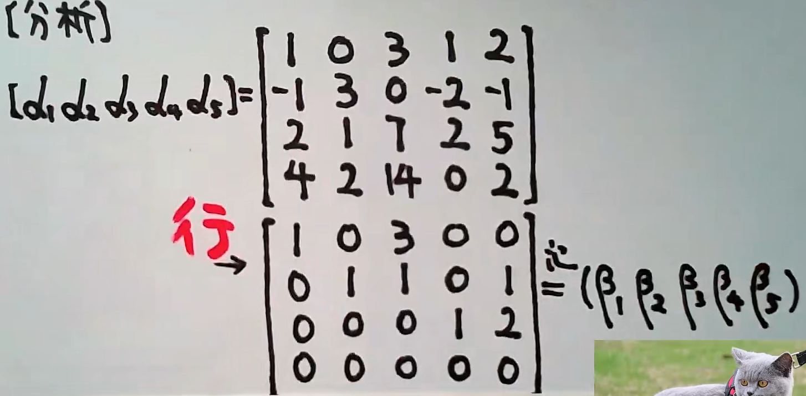
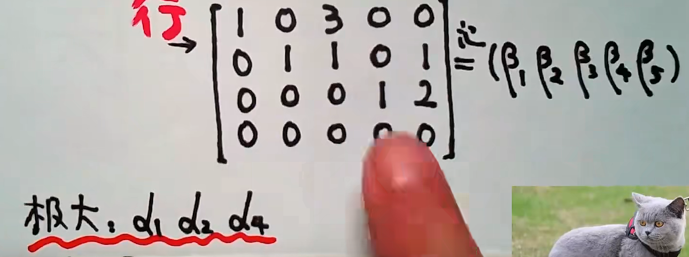
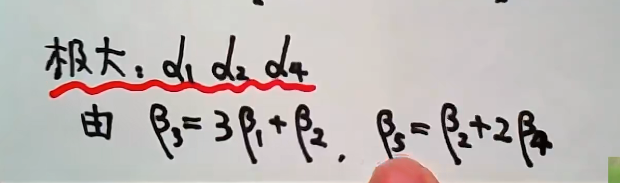
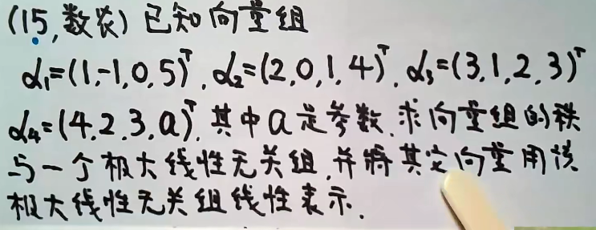
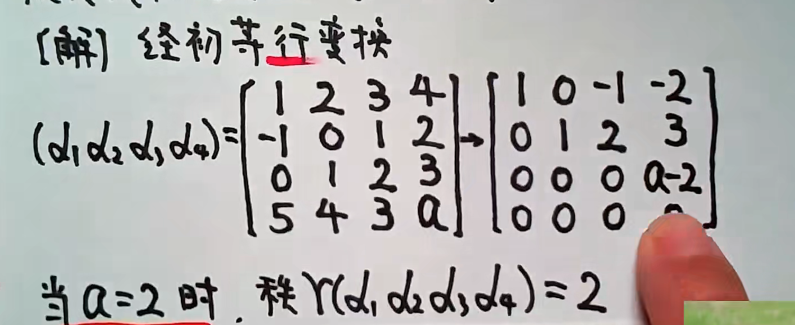
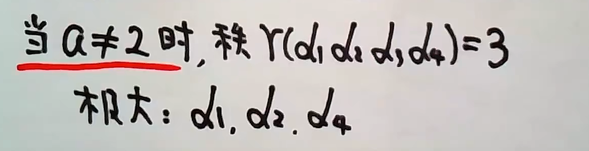

# 线性代数

## 第0章 关于笔记

B站链接：https://www.bilibili.com/video/BV1934y1t7u6?p=11&share_source=copy_web

## 第三章 向量组

### 1.线性表出 相关 无关

**时间**：2021-04-01

#### 例题一：

 

####  例题二：

####  例题三

####  例题四：

#### 例题五：

### 2.线性无关、矩阵的秩

**时间**：2021-04-02

#### 例题一：

#### 例题二：

#### 例题三：

#### 例题四：

### 3.向量组的秩、三秩相等

**时间**：2022-04-02

#### 例题一:

记住：**找主元所在的列**，就是极大无关组

#### 例题二：

